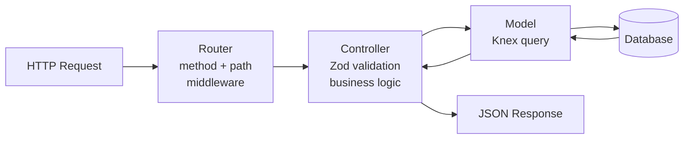
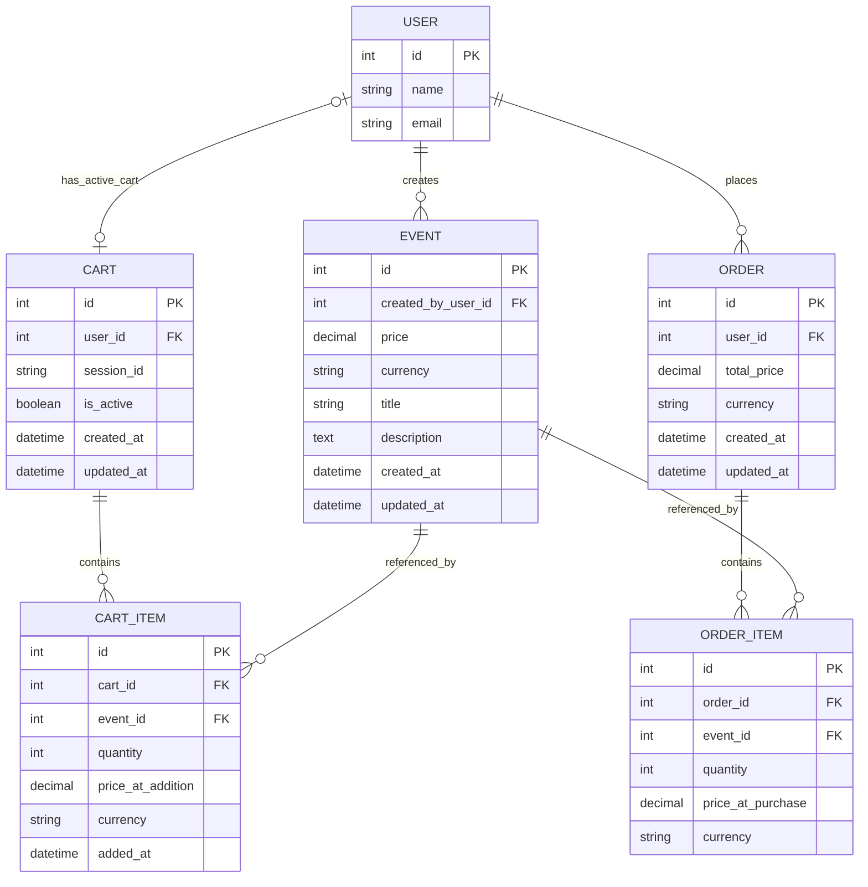

# HYF Events API — Presentation Walkthrough

A REST API for an event ticketing platform built as the HackYourFuture mid-backend specialism project.

## 1. Introduction

This project is a REST API for an event ticketing platform. Users can browse events, add tickets to a cart — even without creating an account — and then check out to place an order.

From the `api` folder run:

```
# First time only — install dependencies
npm install

# Development (auto-restarts on file changes)
npm run dev

# Production (runs migrations then starts)
npm start

```

The server starts at http://localhost:3001. → auto-redirects to `/docs`.

Four route groups in Swagger: **Events**, **Auth**, **Cart**, and **Orders**.

Ctrl + C to shutdown server.

## 2. Final Project Structure

```
api/src/
├── index.mjs                  ← Entry point
│
├── configs/
│   ├── database.js            ← Knex connection (SQLite / PostgreSQL via .env)
│   └── swagger.js             ← Auto-generates /docs from JSDoc comments
│
├── routers/
│   ├── index.js               ← Root router: mounts /api, 404 handler, global error handler
│   ├── api.js                 ← Aggregates all domain routers under /api
│   ├── auth.js                ← POST /signup, POST /login, GET /me
│   ├── events.js              ← GET/POST/PATCH/DELETE /events
│   ├── carts.js               ← GET /cart, POST/PUT/DELETE /cart/items
│   └── orders.js              ← GET /orders, GET /orders/:id, POST /orders/checkout
│
├── controllers/
│   ├── auth.js                ← signup, login, me
│   ├── events.js              ← getEvents, getEventById, postEvent, patchEvent, removeEvent
│   ├── carts.js               ← getCart, postCartItem, putCartItem, deleteCartItemHandler
│   └── orders.js              ← getOrders, getOrderById, postCheckout
│
├── models/
│   ├── auth.js                ← createUser, findUserByEmail, findUserById
│   ├── events.js              ← listEvents, countEvents, findEventById, createEvent, updateEvent, deleteEvent
│   ├── carts.js               ← findOrCreateActiveCart, findActiveCartByUser
│   ├── cart_items.js          ← addCartItem, listCartItems, updateCartItemQuantity, deleteCartItem, getCartSubtotal
│   ├── orders.js              ← listOrdersByUser, findOrderById, createOrderFromCart
│   └── order_items.js         ← createOrderItems, listOrderItems
│
├── middlewares/
│   ├── auth.js                ← requireAuth, optionalAuth (JWT verification)
│   └── index.js               ← Global middleware array (extensible)
│
└── db/
    ├── migrate.js             ← Runs knex migrations
    ├── seed.js                ← Runs all seed files
    ├── migrations/            ← Versioned schema changes (4 files)
    └── seeds/                 ← Dev test data (4 files: users, events, carts, orders)
```

### MVC Pattern

The code follows an MVC pattern — Model, View, Controller. There is no View layer since this is an API.

| Layer      | Folder         | Responsibility                                       |
| ---------- | -------------- | ---------------------------------------------------- |
| Router     | `routers/`     | Declare HTTP routes, apply middleware                |
| Controller | `controllers/` | Validate input (Zod), call models, send response     |
| Model      | `models/`      | All SQL via Knex — no logic, just data access        |
| Middleware | `middlewares/` | Cross-cutting concerns: auth checks, global handlers |

#### Middleware Detail

| File                   | Exports                 | Used on                       |
| ---------------------- | ----------------------- | ----------------------------- |
| `middlewares/auth.js`  | `requireAuth`           | All `/orders` routes          |
|                        | `optionalAuth`          | All `/cart` routes            |
| `middlewares/index.js` | Global middleware array | Mounted in `routers/index.js` |

- **`requireAuth`** — verifies the `Authorization: Bearer <token>` header; returns `401` if missing or invalid
- **`optionalAuth`** — allows guests through with no token; validates and attaches `req.user` if a token is present

### MVC Architecture



---

## 3. Database Evolution

This ERD includes:

- user
- event (domain item)
- cart (supports authenticated and unauthenticated users)
- cart_item
- order
- order_item

### Project Diagram



### Design Decisions

- `cart.user_id` is **nullable** — a cart can be created without a logged-in user (guest/session cart)
- `cart.session_id` is **nullable** — populated for unauthenticated carts to track the guest session; cleared when the cart is claimed by a user
- `cart.is_active` enforces the **one active cart per authenticated user** rule (unique constraint on `user_id` where `is_active = true`)
- `cart_item` uses a **simple single primary key** (`id PK`) — the project default
- `order.user_id` is **required** (NOT NULL) — orders can only be placed by authenticated users
- `price_at_addition` protects the cart from being silently affected by future price changes
- `price_at_purchase` preserves historical accuracy: changing an event's price won't alter past orders

### Migrations & Seeds

Database schema is managed with Knex migrations:

| Migration file                                | Tables / columns      | Description                                                                                                                                                                  |
| --------------------------------------------- | --------------------- | ---------------------------------------------------------------------------------------------------------------------------------------------------------------------------- |
| `20260228120000_create_event_table.js`        | `user`, `event`       | First milestone — establishes the core domain: users can be created and events can be listed                                                                                 |
| `20260422120000_create_cart_tables.js`        | `cart`, `cart_item`   | Adds shopping cart support; `user_id` is nullable to allow guest carts tracked by `session_id`; partial unique index enforces one active cart per user                       |
| `20260422130000_create_order_tables.js`       | `order`, `order_item` | Adds checkout capability; `order.user_id` is NOT NULL — only authenticated users can place orders; `price_at_purchase` captures a price snapshot for immutable order history |
| `20260506120000_add_password_hash_to_user.js` | `user.password_hash`  | Adds password authentication to existing users; column is nullable so users created before auth was scoped in are unaffected — safe migration                                |

---

## 4. Endpoints

### Events

| Method   | Route             | Auth required | Status         |
| -------- | ----------------- | ------------- | -------------- |
| `GET`    | `/api/events`     | —             | ✅ Implemented |
| `GET`    | `/api/events/:id` | —             | ✅ Implemented |
| `POST`   | `/api/events`     | `requireAuth` | Optional       |
| `PATCH`  | `/api/events/:id` | `requireAuth` | Optional       |
| `DELETE` | `/api/events/:id` | `requireAuth` | Optional       |

**`GET /api/events` — paginated list:**

Query parameters:

- `?q=` — search term matched against `title` and `description`
- `?page=` — zero-based page number (default: 0)
- `?pageSize=` — items per page (default: 20, max: 100)

Response shape:

```json
{
  "data": [ ...events ],
  "meta": {
    "page": 0,
    "pageSize": 20,
    "totalItems": 42,
    "totalPages": 3
  }
}
```

Security note: `ALLOWED_SORT_COLUMNS` allowlist in the model prevents SQL injection via the `orderBy` parameter.

**Demo action:** GET `/api/events?q=music&page=0&pageSize=5`.

---

### Auth

| Method | Route              | Auth required | Description                                      |
| ------ | ------------------ | ------------- | ------------------------------------------------ |
| `POST` | `/api/auth/signup` | —             | Register: hash password, create user, return JWT |
| `POST` | `/api/auth/login`  | —             | Verify credentials, return JWT                   |
| `GET`  | `/api/auth/me`     | `requireAuth` | Return current user from token payload           |

**Signup flow:**

1. Zod validates `name`, `email`, `password` (min 8 chars)
2. Check email is not already registered → 409 if duplicate
3. `bcrypt.hash(password, 10)` — 10 salt rounds
4. Insert user row, sign JWT (7-day expiry), return `{ user, token }`
5. `sanitizeUser()` strips `password_hash` from the response

**Login flow:**

1. Zod validates `email` + `password`
2. Find user by email → 401 if not found
3. `bcrypt.compare(password, hash)` → 401 if mismatch
4. Return `{ user, token }`

**Demo action:** POST `/api/auth/signup` in Swagger → copy token → click "Authorize".

---

### Cart

All cart routes apply `optionalAuth` — guests and authenticated users are both supported.

| Method   | Route                     | Description                         |
| -------- | ------------------------- | ----------------------------------- |
| `GET`    | `/api/cart`               | Get the active cart (user or guest) |
| `POST`   | `/api/cart/items`         | Add an event to the cart            |
| `PUT`    | `/api/cart/items/:itemId` | Update item quantity                |
| `DELETE` | `/api/cart/items/:itemId` | Remove an item                      |

**Cart identity resolution (`getCartIdentity`):**

```
Bearer token present  → use userId   (authenticated cart)
x-session-id header   → use sessionId (guest cart)
neither               → 400 error
```

**`POST /api/cart/items` validation (Zod):**

- `eventId` — required, positive integer
- `quantity` — positive integer, defaults to `1`

**`GET /api/cart` response shape:**

```json
{
  "cart": { "id": 3, "user_id": 1, "is_active": true },
  "items": [{ "event_id": 5, "quantity": 2, "price_at_addition": 25.0 }],
  "summary": {
    "subtotal": 50.0,
    "currency": "EUR",
    "line_count": 1,
    "total_quantity": 2
  }
}
```

**Demo action:**

1. Without a token, send `GET /api/cart` with header `x-session-id: demo-guest-1` → guest cart created.
2. `POST /api/cart/items` body `{ "eventId": 1, "quantity": 2 }` → item added.
3. Switch to Bearer token → `GET /api/cart` shows the authenticated user's cart.

---

### Orders — `/api/orders`

All order routes apply `requireAuth` — no guest access.

| Method | Route                  | Description                              |
| ------ | ---------------------- | ---------------------------------------- |
| `GET`  | `/api/orders`          | List all orders for the logged-in user   |
| `GET`  | `/api/orders/:orderId` | Get a single order (ownership checked)   |
| `POST` | `/api/orders/checkout` | Convert active cart to a permanent order |

**Checkout flow — runs in a Knex transaction:**

1. Find the user's active cart → 404 if none
2. Read all `cart_item` rows (with price snapshots)
3. Insert `order` row (total_price, currency)
4. Insert `order_item` rows (price_at_purchase captured now)
5. Set `cart.is_active = false`
6. Create a fresh active cart for future shopping
7. If any step fails → full rollback

**Ownership enforcement (`GET /api/orders/:orderId`):**

```js
if (result.order.user_id !== userId) → 403 Forbidden
```

**Demo action:** POST `/api/orders/checkout` → 201 with `{ order, items, newCart }`.

---

## 6. Reflection & Q&A

**Key Takeaways**

- MVC separates concerns cleanly — a database bug lives in the model, not scattered across the codebase
- JWT stateless auth — the server carries no session state; the token holds user identity
- Database constraints (partial unique index, FK cascade rules) enforce business rules more reliably than application-layer checks alone
- Knex transactions are essential for multi-step writes — checkout touches 4 tables atomically

**Future work**

| Feature                            | Description                                                                                                                        |
| ---------------------------------- | ---------------------------------------------------------------------------------------------------------------------------------- |
| Merge guest cart on login          | When a user logs in, transfer all items from their guest cart (`session_id`) into their authenticated cart so nothing is lost      |
| Pagination on `GET /api/orders`    | Add `?page=` and `?pageSize=` query parameters to the orders list, matching the pattern already used in `GET /api/events`          |
| Implement `POST /api/events`       | Replace the `501` placeholder with real logic: validate the body with Zod, call `createEvent()` in the model, return the new event |
| Implement `PATCH /api/events/:id`  | Allow updating an event's title, description, price, or currency; validate that only the owner can edit their own event            |
| Implement `DELETE /api/events/:id` | Soft-delete or hard-delete an event; add a check that the event has no active cart items before allowing deletion                  |
| Role-based access control          | Add a `role` column to `user` (`user` / `admin`); restrict event creation, update, and deletion to admin users only                |
| Order cancellation                 | Add `POST /api/orders/:orderId/cancel` that sets a `status` column on `order` to `cancelled` and restores event availability       |

---

## Quick Command Reference

```bash
# Start the API
cd api && npm run dev

# Run migrations
npm run migrate

# Rollback last migration
npm run migrate:rollback

# Seed the database
npm run seed

# Lint
npm run lint
```
