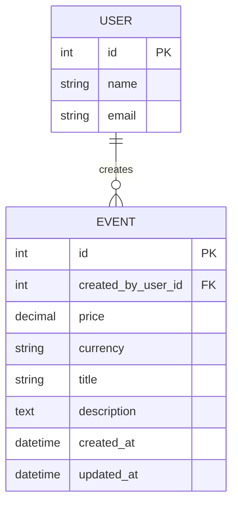

# ERD

## Scope

This v1 ERD includes:

- user
- event (domain item)

## Project Diagram

```mermaid
erDiagram
    USER ||--o{ EVENT : creates

    USER {
        int id PK
        string name
        string email
    }

    EVENT {
        int id PK
        int created_by_user_id FK
        decimal price
        string currency
        string title
        text description
        datetime created_at
        datetime updated_at
    }
```
