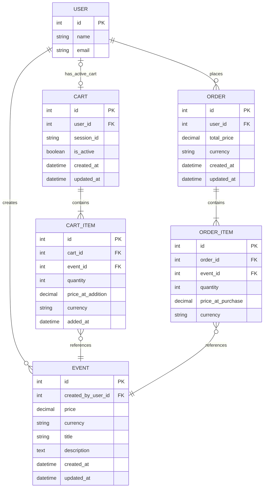

# ERD

## Scope

This v2 ERD includes:

- user
- event (domain item)
- cart (supports authenticated and unauthenticated users)
- cart_item
- order
- order_item

## Design Decisions

- `cart.user_id` is **nullable** — a cart can be created without a logged-in user (guest/session cart)
- `cart.session_id` is **nullable** — populated for unauthenticated carts to track the guest session; cleared when the cart is claimed by a user
- `cart.is_active` enforces the **one active cart per authenticated user** rule (unique constraint on `user_id` where `is_active = true`)
- `cart_item` uses a **simple single primary key** (`id PK`) — the project default
- `order.user_id` is **required** — orders can only be placed by authenticated users

## Project Diagram

